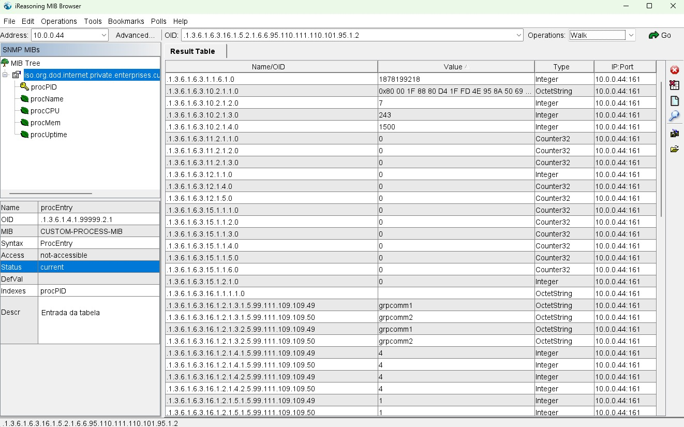
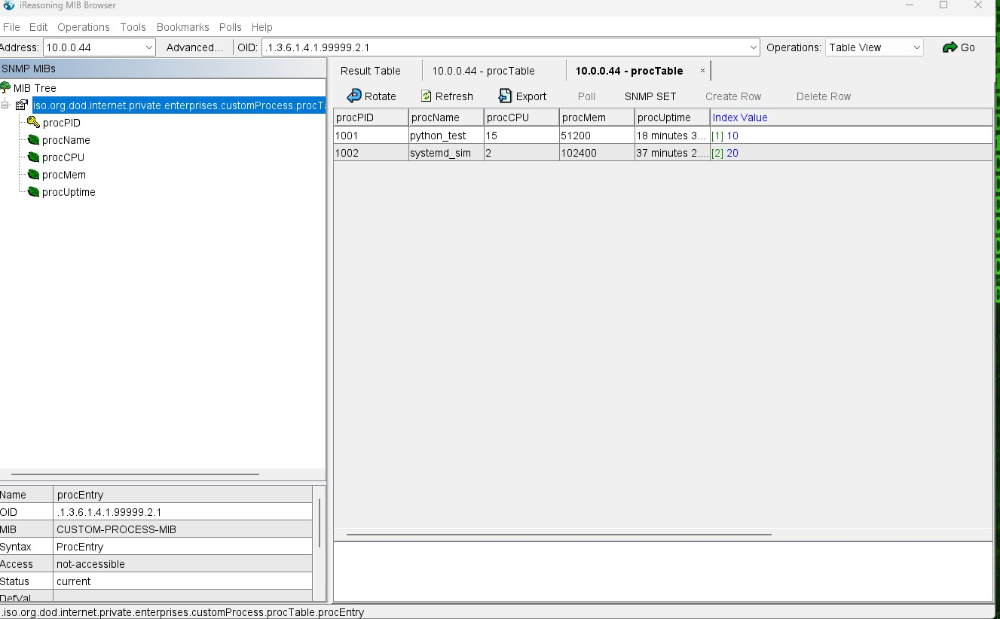
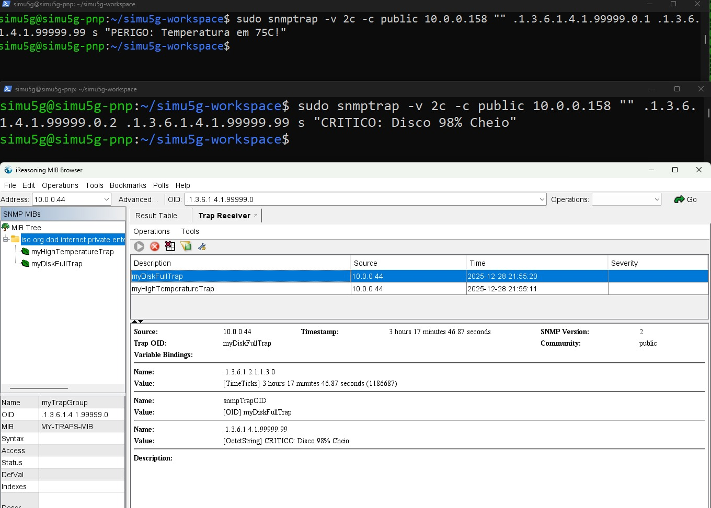

# Atividade Prática de Gerenciamento de Redes (Hands On - Part 3)

Este repositório contém a implementação da extensão do agente SNMP (Net-SNMP).

```text
Equipe: 

- ANA KAROLINE BORGES CARNEIRO - 584246
- CLEITIANNE OLIVEIRA DA SILVA - 584331
- LARISSE CRUZ LUCAS - 584253
```
## 📋 Pré-requisitos

* **Agente:** Ubuntu 24.04 LTS (IP: `10.0.0.X`)
* **Gerente:** Windows com **iReasoning MIB Browser**
* **Pacotes Necessários (Ubuntu):**
    ```bash
    sudo apt update
    sudo apt install snmp snmpd libsnmp-dev python3 -y
    ```

---

## ⚙️  Configuração

Antes de executar as tarefas, é necessário configurar o arquivo `/etc/snmp/snmpd.conf` para permitir acesso externo e integrar os scripts.

1.  Ajuste o arquivo de configuração:
    ```bash
    sudo nano /etc/snmp/snmpd.conf
    ```
2.  Reinicie o serviço sempre que alterar este arquivo:
    ```bash
    sudo service snmpd restart
    ```

---

## 📝 Tarefa #01: Controle de Serviço (Custom Control)

**Objetivo:** Ler o status do snmpd e reiniciar o serviço remotamente.

**Arquivo MIB:** 
```text
CUSTOM-CONTROL-MIB.txt
```
O arquivo de definição desta MIB está disponível na pasta MIBs deste repositório no GitHub.

***Ação:*** Carregue este arquivo no iReasoning MIB Browser para visualizar os nomes dos objetos

### 1. Script (`/usr/local/bin/snmp_control.py`)
Crie o arquivo e cole o código disponibilizado no github. Dê permissão de execução: `sudo chmod +x /usr/local/bin/snmp_control.py`.

### 2. Como testar no iReasoning

- Address: IP do Ubuntu

- OID: .1.3.6.1.4.1.99999.1

- Operação GET: Deve retornar 1 (Running).

- Operação SET:

- Mude Operations para Set.

- Data Type: Integer.

- Value: 3 (Para reiniciar).

- Clique em Go. (O serviço irá reiniciar no Linux).

### 📸 Evidências (Tarefa 1)
Abaixo estão os prints comprovando o funcionamento da leitura de status e do comando de reinício.


---
## 📝 Tarefa #02: Tabela de Processos

**Objetivo:** Listar PID, Nome, CPU, Memória e Uptime via tabela SNMP.

**Arquivo MIB:** 
```text
CUSTOM-PROCESS-MIB.txt
```

O arquivo contendo a estrutura da tabela está disponível na pasta MIBs do repositório.

***Ação:*** Importe este arquivo no seu navegador MIB para estruturar corretamente as colunas da tabela de processos.


### 1. Script (`/usr/local/bin/snmp_table.py`)
Crie o arquivo no diretório indicado, copie e cole o conteúdo do arquivo snmp_table.py disponível neste repositório GitHub e dê permissão de execução: `sudo chmod +x /usr/local/bin/snmp_table.py`.


### 2. Como testar no iReasoning

Execução:

- Operação: Selecione Walk (ou Get Subtree).

- Resultado: A tabela deve preencher com os processos listados.

### 📸 Evidências (Tarefa 2)
Abaixo estão os prints da execução do Walk e a tabela preenchida no Mib Browser.





## 📝 Tarefa #03: Traps (Notificações)

**Objetivo:** Enviar alertas de "Alta Temperatura" e "Disco Cheio".

### 1. Arquivo MIB (`CUSTOM-TRAPS-MIB.txt`)
O arquivo contendo a estrutura da tabela está disponível na pasta `MIBs` deste repositório GitHub. Importe-o no Mib Browser antes de realizar os testes.

1. Preparação no Windows (iReasoning)
- No menu Tools > Trap Receiver.

- Verifique se está escutando na porta 162 e clique em "Start".

```text 
Atenção: Se não chegar nada, desative temporariamente o Firewall do Windows ou permita a porta UDP 162.
```

2. Execução no Ubuntu
Execute os comandos abaixo no terminal para simular os problemas descritos. Lembre-se de substituir 192.168.X.X pelo IP do seu Windows.

- Trap 1: Temperatura Alta (.0.1)

```bash
sudo snmptrap -v 2c -c public 192.168.X.X "" .1.3.6.1.4.1.99999.0.1 \
.1.3.6.1.4.1.99999.0.1 s "ALERTA: Temperatura > 70C"
```

- Trap 2: Disco Cheio (.0.2)
```bash
sudo snmptrap -v 2c -c public 192.168.X.X "" .1.3.6.1.4.1.99999.0.2 \
.1.3.6.1.4.1.99999.0.2 s "CRITICO: Disco 95% cheio"
```

```text
Verificação
Olhe a janela "Trap Receiver" no iReasoning. As mensagens devem aparecer instantaneamente.
.1.3.6.1.4.1.99999.0.2 s "CRITICO: Disco 95% cheio"
```
### 📸 Evidências (Tarefa 3)

